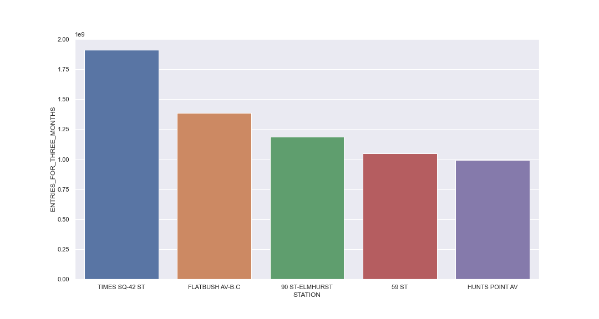

## Analysis of the Survey plan for MTA transportation plan 
\
The goal of this project is to find out the most/least busiest time in a day for each SCP and the average traffic of these time and SCP locations.

I use pandas and seaborn to analyse the data and create a bar plot. The barplot shows the top 5 stations of the total traffic during July, August, and September in 2021.

Conclusion: I found that "TIME-SQ-42ST", "FLAT BUSH AV-B.C.", "90 ST-ELMHURST STATION", "59 ST", and "HUNT POINT AV" are the top five stations of three-months total entry that worth to pick for survey design.

